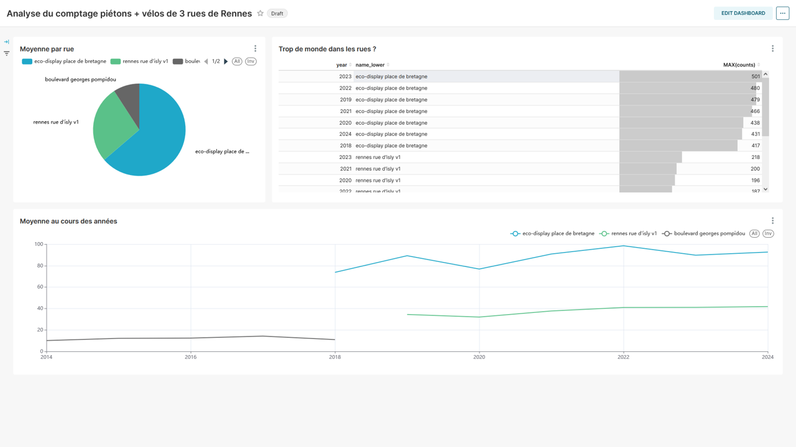

# Feuille de route Bachelor
## Initalisation
1. Avoir réalisé l'étape de mise en place
    * [DOC - mise en place de l'atelier](https://github.com/KyllianBeguin/SupDeVinciAtelierData?tab=readme-ov-file#mise-en-place)
2. Créer des utilisateurs sur l'instance Apache Superset
    * Adresse `<IP-de-ma-VM>:8088`
    * Utilisateur : `admin`
    * MotDePasse : `admin`
3. Connecter les pc étudiants à l'instance Apache Superset
4. Avec chaque compte, initier un dashboard et le sauvegarder
    * Ces dashboards sont également visibles par l'admin.

## Feuille de route
1. Placer les étudiants sur les pc
2. Présenter l'objectif : **Comprendre les données de comptages de vélo et piétons à Rennes**
3. Montrer comment faire un graphique type
4. Faire créer des graphiques ("Charts") par les étudiants
    * 3 graphiques à réaliser :
        1. Une visualisation du comptage moyen par année, selon les points de comptage
        2. Une moyenne totale par point de comptage
        3. Un tableau du comptage max par année, selon les points de comptage

## Exemple de réalisation

